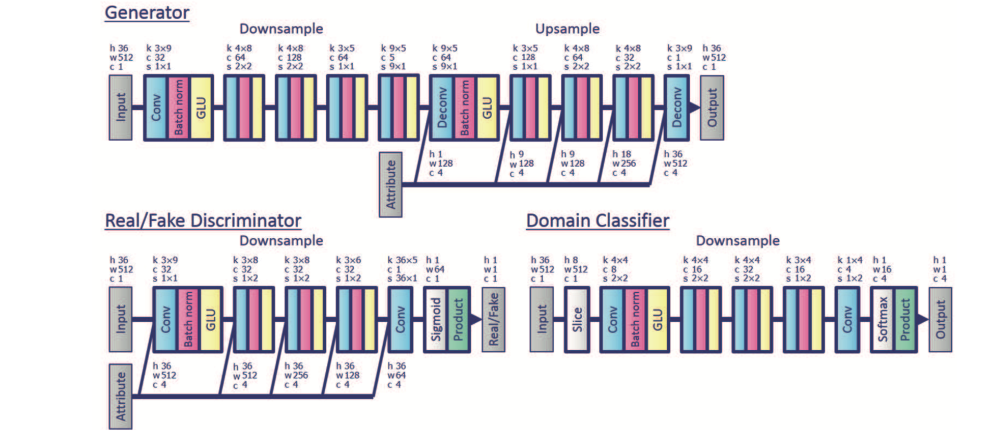

# スターGAN ボイスコンバージェンス  メモ

[StarGAN VC(pytorch版)リポジトリ](https://github.com/hujinsen/pytorch-StarGAN-VC)の日本語による説明．
あとソースコードの微修正．

**[Original Paper]**  
[StarGAN-VC: Non-parallel many-to-many voice conversion with star generative adversarial networks](https://arxiv.org/abs/1806.02169).

**変換音声は*converted*ディレクトリに保存される．**

# Dependencies

- Python 3.6 (or higher)
- pytorch 1.1 (see [https://pytorch.org/](https://pytorch.org/))
- tensorflow 1.14
- librosa 
- pyworld 
- tensorboard
- scikit-learn

> NOTE:According to some feedbacks, we recommend to use tensorflow version 1.8  exactly. (Tensorflow 1.11 generate nonsense results)

# Usage

## Download dataset

vcc 2016データセットはここからダウンロードできるよ！

Data Share -  SUPERSEDED - The Voice Conversion Challenge 2016  
[https://datashare.is.ed.ac.uk/handle/10283/2042](https://datashare.is.ed.ac.uk/handle/10283/2042)

1. **訓練データセット:**
  ここからデータセットZIPファイルをダウンロード[VCC training data: source and target evaluation data (7.357Mb)](https://datashare.is.ed.ac.uk/bitstream/handle/10283/2042/evaluation_all.zip?sequence=17&isAllowed=y)して解凍する．解凍して出てきた`vcc2016_training`を`data`フォルダ内に保存．

2. **テストデータセット:**
  ここからデータセットZIPファイルをダウンロード[VCC training data: evaluation data released to participants during the challenge (3.576Mb)](https://datashare.is.ed.ac.uk/bitstream/handle/10283/2042/evaluation_release.zip?sequence=18&isAllowed=y)して解凍する．解凍して出てきた`evaluation_all`を`data`フォルダ内に保存．

保存したデータの一部を以下の訓練セットフォルダとテストセットフォルダに保存する．

1. **訓練セット:** `./data/vcc2016_training`から４人のスピーカ(SF1,SF2,TM1,TM2)を選んで`./data/speakers`に保存する.
2. **テストセット** `./data/evaluation_all`から４人のスピーカ(SF1,SF2,TM1,TM2)を選んで`./data/speakers_test`に保存する.

↓↓ 以下はフォルダ構成をまとめたもの．

```
data
├── speakers  (training set <  vcc2016_trainingから４つのフォルダをコピーしてぶち込む)
│   ├── SF1
│   ├── SF2
│   ├── TM1
│   └── TM2
├── speakers_test (testing set <  evaluation_allから４つのフォルダをコピーしてぶち込む)
│   ├── SF1
│   ├── SF2
│   ├── TM1
│   └── TM2
├── vcc2016_training (vcc2016_training.zipを解凍したときに出てくるフォルダ)
│   ├── SF1
|   ├── SF2
|   ├── SF3
│   ├── ...
├── evaluation_all (evaluation_all.zipを解凍したときに出てくるフォルダ)
│   ├── ...
```


## Preprocess

はじめに`preprocess.py`を実行して音声クリップから特徴量(mcep：メルケプストラム，f0：基本周波数，ap：非周期性指標)を抽出する．それらの特徴量は`.npy`ファイルにソートして保存される．`preprocess.py`の実行コマンドは以下の通り．

```
python preprocess.py
```

約5~10分ぐらいかかるよ！
**テスト時は*preprocess*が必要ない！**

## Train

学習実行時，何エポックごとかに`result_***`ディレクトリに学習データに対する処理結果が保存される．
`result_***`にテストデータに対する処理結果(たぶん？)が保存される．実行コマンドは以下の通り．

```
python main.py
```


## Convert

```
python main.py --mode test --test_iters 200000 --src_speaker TM1 --trg_speaker "['TM1','SF1']"
```


# Summary

The network structure shown as follows:




# Reference

[CycleGAN-VC code](https://github.com/leimao/Voice_Converter_CycleGAN)

[pytorch StarGAN-VC code](https://github.com/hujinsen/pytorch-StarGAN-VC)

[StarGAN code](https://github.com/taki0112/StarGAN-Tensorflow)

[StarGAN-VC paper](https://arxiv.org/abs/1806.02169)

[StarGAN paper](https://arxiv.org/abs/1806.02169)

[CycleGAN paper](https://arxiv.org/abs/1703.10593v4)
